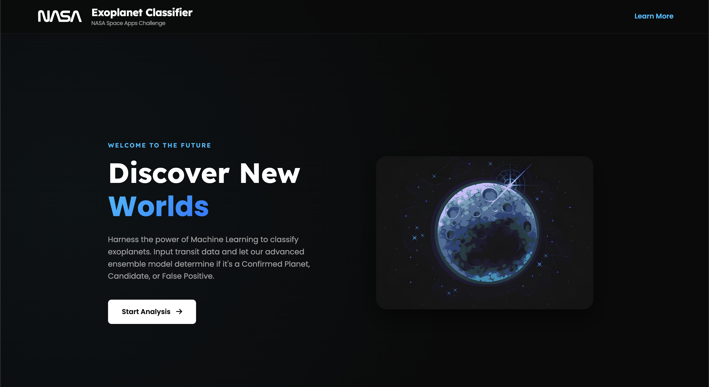
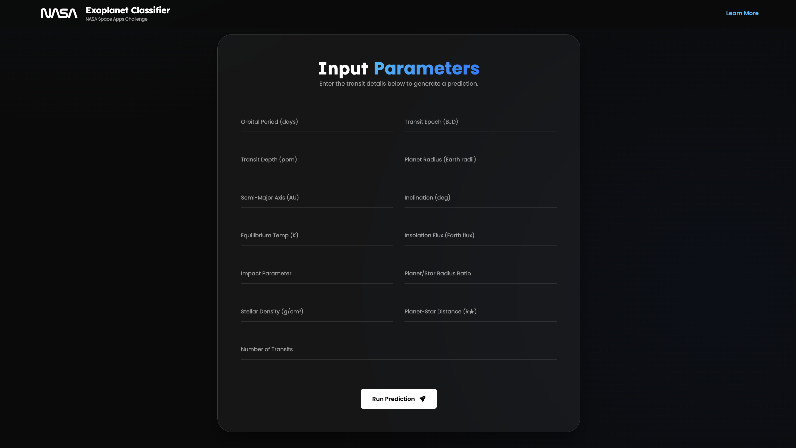
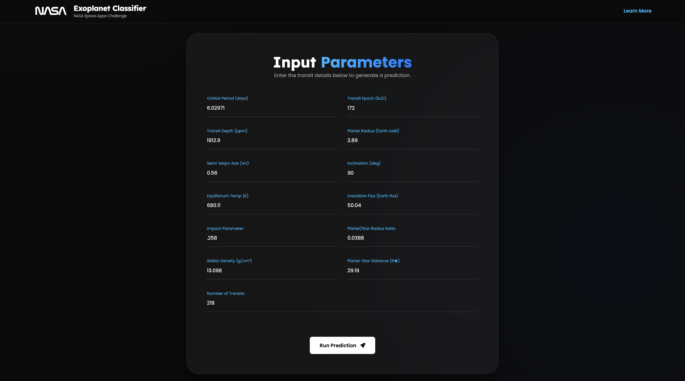
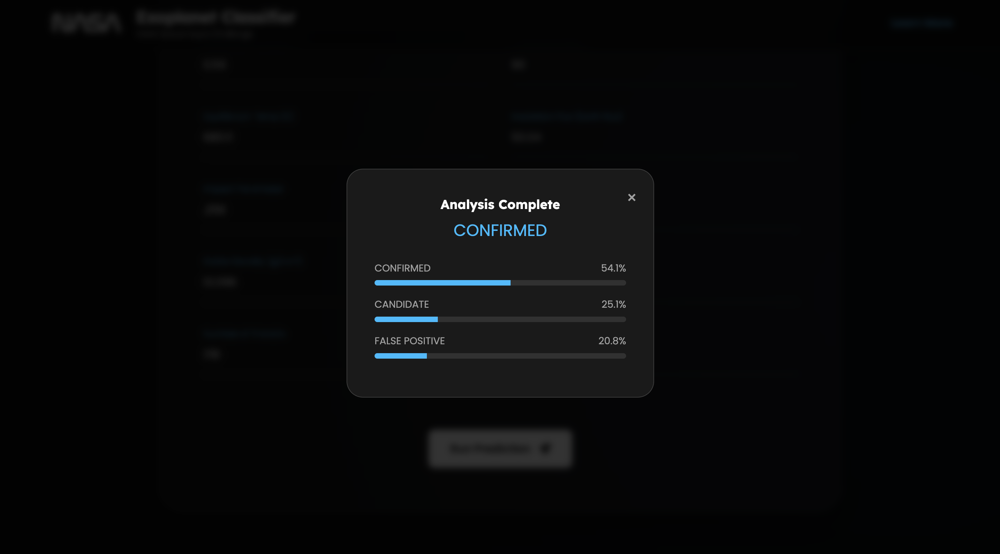
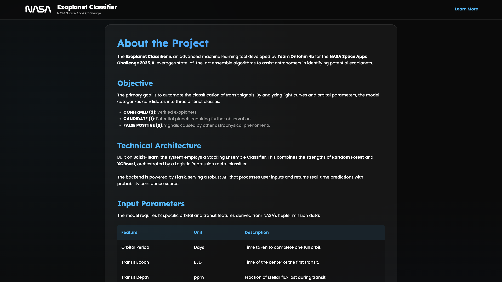

# The Exoplanet Classifier 🪐

> Welcome to my enhanced fork of **The Exoplanet Classifier**. Originally developed with my teammates from **Ontohin 4b** for the **NASA Space Apps Challenge 2025**, this project now represents the upgraded and research-extended version of that submission.  
> 
> The original repository remains archived under Ontohin 4b and licensed as such. This fork exists purely for further research, experimentation, and personal development to make the classifier far more powerful and accurate than the hackathon version.

A robust, data-driven Machine Learning tool that classifies whether a given set of transit data corresponds to a **confirmed exoplanet**, **false positive**, or **candidate**.  
This version blends the strengths of **ensemble learning** with extensive preprocessing, imputation, and class balancing, resulting in a more stable and generalizable model.

---

## Table of Contents

- [The Exoplanet Classifier 🪐](#the-exoplanet-classifier-)
  - [Table of Contents](#table-of-contents)
  - [Project Overview](#project-overview)
  - [Screenshots](#screenshots)
  - [Tech Stack](#tech-stack)
  - [Getting Started](#getting-started)
  - [How to Use](#how-to-use)
  - [Project Structure](#project-structure)
  - [Model Details](#model-details)
    - [Architecture](#architecture)
    - [Preprocessing Pipeline](#preprocessing-pipeline)
    - [Features](#features)
    - [Labels](#labels)
    - [Data Sources](#data-sources)
    - [Training Workflow](#training-workflow)
    - [Evaluation](#evaluation)
  - [Acknowledgements](#acknowledgements)
  - [Appreciation](#appreciation)

---

## Project Overview

NASA’s exoplanet survey missions (Kepler, K2, and others) have generated thousands of data points using **the transit method** — tracking dips in starlight caused by orbiting planets.  
These datasets contain both **confirmed exoplanets** and **false positives**, and the aim of this project is to build an AI classifier capable of making preliminary predictions on new candidates.

The classifier runs inside a **Flask-powered web interface**, allowing anyone — from students to researchers — to enter transit parameters and instantly receive a prediction.  

The goal is to provide a *scientifically meaningful, intuitive, and educational experience* for users interested in exoplanet research.

---

## Screenshots
**Landing Page**

**Input Fields**

**Input Fields when filled**

**Output**

**About Page**


  

---

## Tech Stack

- **Python 3.11 or above** – Core programming language  
- **Pandas, NumPy** – Data processing and numerical computation  
- **Scikit-learn** – Pipeline, scaling, imputation, model stacking, metrics  
- **XGBoost** – Gradient boosting-based sub-model for ensemble  
- **Imbalanced-learn (SMOTE)** – Class balancing for improved fairness  
- **Flask** – Backend web framework  
- **HTML/CSS/JavaScript** – Frontend for the interactive web UI  
- **Jupyter Notebook** – Used as a sandbox (`research.ipynb`) to experiment with different model architectures, hyperparameters, and feature engineering before finalizing `fit.py`.

---


## Getting Started


1.  **Clone the repository**


```bash
git  clone  https://github.com/ByteBard58/Exoplanet_Classifier
cd  "Exoplanet_Classifier"
```
  
2.  **Install dependencies**

```bash
pip  install  -r  requirements.txt
```

3.  **Run the Flask app**

```bash
python  app.py
```
4. Open your browser and go to `http://127.0.0.1:5000` to access the web interface.

5. If you want to close the server, press `Ctrl + C` in the terminal where you have run `app.py` from.  

---
  
## How to Use

- Press **Get Started** on the webpage.

- Enter the candidate features in the input fields (values like Orbital Period, Transit Epoch, Transit Depth, etc.).

- Click **Predict** to run the prediction.

- For more detailed information about each input and other subjects, press **LEARN MORE** (located at the top).

---

## Project Structure

```
EXOPLANET_CLASSIFIER/
├── .github/              # Folder for GitHub actions
│
├── data/             
│   ├── k2_data.csv
│   ├── kepler_data.csv
│   └── source.txt
│
├── models/              
│   ├── column_names.pkl    # Not included in the repo
│   ├── info.txt
│   └── pipe.pkl            # Not included in the repo
│
├── screenshots/           
│
├── static/
│   ├── materials/
│   └── script.js
│
├── templates/
│   ├── about.html
│   └── index.html
│
├── .gitignore
├── app.py
├── fit.py
├── LICENSE
├── README.md
├── requirements.txt
└── research.ipynb
```

---

## Model Details

### Architecture
The upgraded classifier uses a **stacking ensemble** combining multiple base models with a meta-classifier:

- **Base Models:**
  - `RandomForestClassifier`
    - `n_estimators=1000`
    - `max_depth=None`
    - `class_weight="balanced"`
  - `XGBClassifier`
    - `n_estimators=1000`
    - `max_depth=None`
    - `learning_rate=0.5`
- **Meta-classifier:**
  - `LogisticRegression`
    - `solver="saga"`
    - `penalty="l2"`
    - `C=0.1`
    - `class_weight="balanced"`
    - `max_iter=5000`

The stacking classifier uses **5-fold cross-validation** internally and passes original features to the meta-classifier for better learning.

---

### Preprocessing Pipeline
Before feeding data into the model, the following preprocessing steps are applied via a `Pipeline`:

1. **Imputation:** `SimpleImputer(strategy="mean")` to handle missing values.  
2. **Scaling:** `StandardScaler` to normalize features.  
3. **Class Balancing:** `SMOTE` (Synthetic Minority Oversampling Technique) to address class imbalance.  
4. **Model Training:** Stacking ensemble as described above.

---

### Features
The model uses 13 transit and orbital-related features, including:

- Orbital period, transit epoch, transit depth  
- Planetary radius, semi-major axis, inclination  
- Equilibrium temperature, insolation, impact parameter  
- Radius ratios, density ratios, duration ratios  
- Number of observed transits

---

### Labels
Targets are mapped as follows:

- `0` → FALSE POSITIVE or REFUTED  
- `1` → CANDIDATE  
- `2` → CONFIRMED

---

### Data Sources
- [Kepler Objects of Interest (KOI)](https://exoplanetarchive.ipac.caltech.edu/cgi-bin/TblView/nph-tblView?app=ExoTbls&config=cumulative)  
- [K2 Planets and Candidates](https://exoplanetarchive.ipac.caltech.edu/cgi-bin/TblView/nph-tblView?app=ExoTbls&config=k2pandc)

---

### Training Workflow
- Train/test split: **2/3 training, 1/3 testing** with stratification on class labels.  
- Pipeline is trained end-to-end in `fit.py`.  
- Hyperparameters and model choices were extensively tested in [research.ipynb](https://github.com/ByteBard58/Exoplanet_Classifier/blob/main/research.ipynb), which served as a sandbox for experimentation and optimization.  
- Final trained pipeline is saved as `models/pipe.pkl` and column order as `models/column_names.pkl`.

---

### Evaluation

The model was evaluated on a held-out test set (1/3 of the data, stratified by class).  
Here is the classification report:

| Class | Precision | Recall | F1-score | Support |
|-------|----------|--------|----------|--------|
| 0 (FALSE POSITIVE / REFUTED) | 0.82 | 0.81 | 0.82 | 1718 |
| 1 (CANDIDATE) | 0.56 | 0.55 | 0.56 | 1118 |
| 2 (CONFIRMED) | 0.79 | 0.81 | 0.80 | 1687 |

**Overall Metrics:**

- **Accuracy:** 0.75  
- **Macro Avg:** Precision = 0.72, Recall = 0.72, F1-score = 0.72  
- **Weighted Avg:** Precision = 0.74, Recall = 0.75, F1-score = 0.75  

This demonstrates that the upgraded stacking classifier maintains strong performance on confirmed and false positive classes, with room for improvement on candidate predictions.  
The model balances **accuracy, generalization, and class fairness**, making it reliable for preliminary exoplanet classification tasks.

---
  
## Acknowledgements

  

  

- NASA Kepler and K2 Mission for providing the training datasets

  

- Scikit-learn, XGBoost, and Imbalanced-learn teams for exceptional libraries

  

- Inspiration from data science projects exploring real-world astrophysics datasets

  

- The scientists who are engaged with exoplanet research. Their problem inspired us to create this project from the ground up

- Ontohin 4b team for the original NASA SAC 2025 version of this project

---  

## Appreciation

Thank you for checking out this upgraded version of The Exoplanet Classifier.
This repository is a personal continuation of a NASA Space Apps Challenge project — rebuilt with the intent to learn, improve, and explore the depths of real-world astrophysics through Machine Learning.

**Have a great day !**
